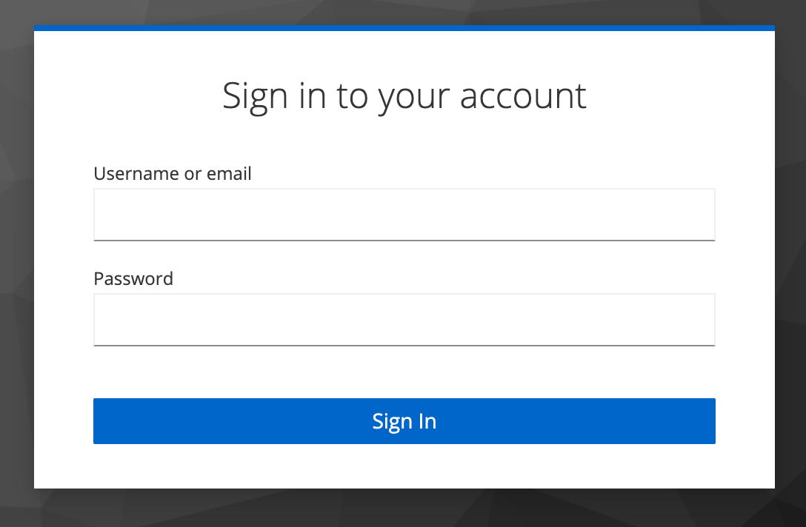
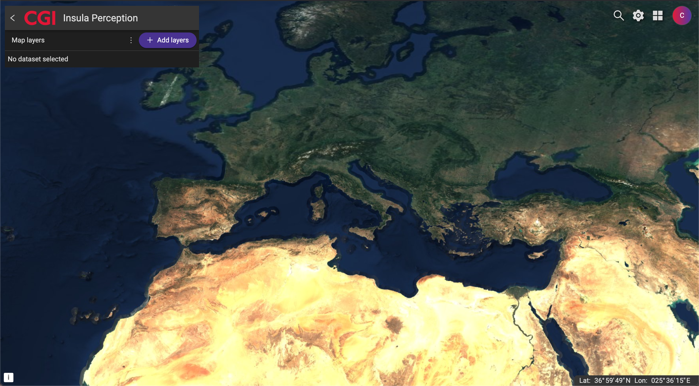

.. _getting_started:

Getting Started
===============

.. _base_urls:

Base URLs
---------

Insula is accessible at the following base URL:

* https://iride-cyberitaly.space/

Accessing Insula
-----------------

Insula can be accessed at `<base_url>` (see :ref:`base_urls`).

Upon accessing one of these URLs, a form similar to the following will be displayed. Type your access credentials and press the **Sign In** button.

Insula Perception
++++++++++++++++++

*Insula Perception* is the Insula's landing page, showing one of its key features that is the ability to explore, find and exploit a range of data and services related to the Earth Observation.

After entering your credentials and signing in, you will see a page similar to:

